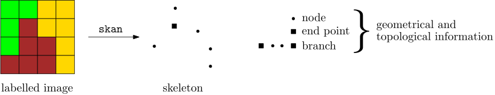
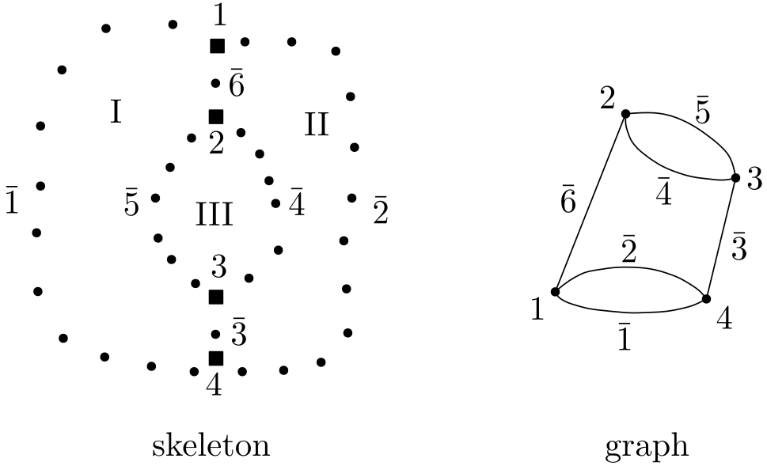
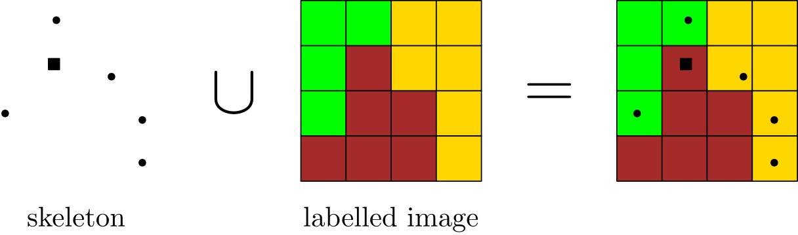
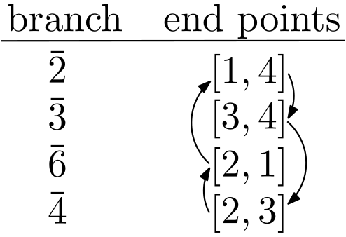
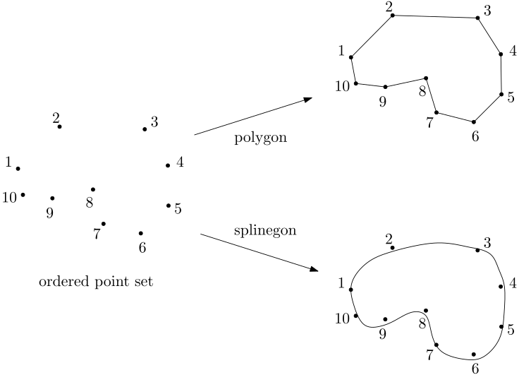

# Algorithms

The goal of this document is to provide more low-level algorithmic details than what is given in our paper. In fact, the material presented here is complimentary to the paper. The paper concentrates on the intuition behind the methods and shows the high-level structure, also citing the relevant literature.


## From image to geometry

It is recommended to read Section 2.3 of the paper first and then this section.

The algorithm to construct a geometrical representation out of a segmented image is complex. To reduce the complexity, we created composable parts. We start with some notions below. Then the main steps of the algorithm is discussed in the upcoming subsections. 

Grains can have different *representations*. When represented as an image (input in our algorithm), it is a set of pixels labelled with the same positive integer. A grain can be given different geometrical representations. It can be the assembly of primitive shapes, usually triangles. One can also describe a grain by its boundary. For example, piecewise linear boundary segments lead to a *polygon*, connecting spline curves lead to a *splinegon*. A grain can also be represented as a *cycle of a graph*.

We make distinction between *topological* and *geometrical* data. Topological data includes connectivity, neighbourhood and membership information. Coordinates of points are examples for geometrical data. Separating these two terms allows us to build abstractions in the code, making it understandable and extensible.


### Skeleton of the image

Based on the segmented/labelled image, [*skan*](https://github.com/jni/skan) builds the skeleton network, as demonstrated on a sample image below. The different pixel colors represent different labels.



As a preprocessing step, we create an additional labelled region that surrounds the original labelled image. The reason is that this way, *skan* will create branches along the boundary of the original image, which will close the boundary grains. It also simplifies the algorithms we will use later because the boundary interfaces can be handled in the same way as the internal ones: every interface separates exactly two grains.


### Which branches form a grain?

The question arises: given the branches, how to reconstruct the grains? First, let us try a graph theoretic approach. In the example below, we want to identify the three grains denoted by roman numerals. The network of branches can be represented as a graph, in which the vertices are the end points and the edges correspond to the branches.



Adequately selected cycles in this graph would give the grains. However, as discussed in the paper, determining the grains based on the graph exclusively would be very challenging because of the following characteristics.

-  For general microstructures, the graph contains multiple edges (see the example above), which rules out many graph processing methods.

-  Finding all the elementary cycles in the graph is too costly for graphs coming from realistic microstructures. Even if we found all the cycles, we would need a criterion to choose which ones correspond to grains. E.g. the cycle ``$` \bar{6}-\bar{2}-\bar{3}-\bar{5} `$`` does not encompass a single grain but the union of two grains.

-  Another technique to find the correct cycles would be the minimum cycle basis. However, this basis is not unique so there is no guarantee that we find the adequate cycles.

The solution is to use both topological and geometrical information. The skeleton is superimposed on the labelled image (from which it was constructed by *skan*) and the labels around a given skeleton node or end point is detected. Staying with the example in the [first subsection](#skeleton-of-the-image), the scheme is shown below.




In the following, we describe two algorithms to find out which two grains are incident to a branch (remember that [always two grains neighbor a branch](#skeleton-of-the-image)). 

#### Algorithm 1

The neighbor search around every node of a branch is performed and the two most common labels are chosen. Since in the image representation the grain is a set of pixels having the same label, the selected two labels give the neighboring two grains to a branch.

#### Algorithm 2

Finding the neighboring labels to every node of a branch may take a lot of time for high-resolution images. Hence, another strategy has also been implemented in which the neighbor search is performed only for the end points of the branches. The common neighboring grains to the two end points of a branch are the grains that contain the branch. 

#### Neighbor definitions

As described in the paper, certain scenarios necessitate to consider various neighborhood definitions. For those definitions, see the documentation of the [`grains.utils.neighborhood`](functions/grains.utils.neighborhood.html) function.


Going back to the first configuration in the beginning of this section, Algorithm 1 or Algorithm 2 gives the following branch-grain connectivities.

```math
\bar{1} &: [\mathrm{I}] \\
\bar{2} &: [\mathrm{II}] \\
\bar{3} &: [\mathrm{I}, \mathrm{II}] \\
\bar{4} &: [\mathrm{III}, \mathrm{II}] \\
\bar{5} &: [\mathrm{I}, \mathrm{III}] \\
\bar{6} &: [\mathrm{II}, \mathrm{I}] \\
```

Inverting this relationship gives the grain-branch connectivities:

```math
\mathrm{I} &: [\bar{1}, \bar{3}, \bar{5}, \bar{6}] \\
\mathrm{II} &: [\bar{2}, \bar{3}, \bar{6}, \bar{4}] \\
\mathrm{III} &: [\bar{5}, \bar{4}]
```

The grain-branch connectivities are an intermediate representation (topological-geometrical). It is independent of how we geometrically represent a grain later.


### Grains as oriented planar surfaces

The previous part of the reconstruction algorithm determined which branches bound a grain. In order to obtain a surface representation of a grain, the boundary must be oriented and hence the branches must be connected in the appropriate order. The following figure demonstrates for grain ``$` \mathrm{II} `$`` the working of a brute-force algorithm.



The branches are interlaced based on their common junctions. The arrows show which branches follow in order. Note that the default orientation of branches ``$` \bar{3} `$`` and ``$` \bar{4} `$`` needs to be swapped.

Finally, we arrive at a fully geometrical description because each grain is now given by a series of points (nodes and end points) along its boundary.


### Geometrical representations of grains

Now that we have a list of points, we can build two geometrical representations of a grain. In the *polygon representation*, the list of points are the consecutive vertices of the polygon. Their coordinates are stacked, the first vertex being repeated to "close" the polygon. In the *spline representation*, the list of points on each branch act as a knots of a B-spline. Once the bounding splines have been constructed, the planar spline surface (splinegon) is spanned by those bounding splines.


