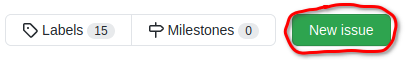
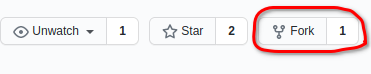
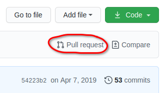

# Contributing

*CristalX* is an open-source project that welcomes contributions of any kind.


## What can you help in?

The major fields in which you can help are the following (in increasing complexity).


### Use cases

If you use *CristalX* in your project, let us know. Parts of your code, if they are general enough to be incorporated, could be included in *CristalX*. Make contact with us by [opening an issue](#open-an-issue).


### Documentation

If the documentation of some functions

-  is missing
-  is incomprehensible
-  does not contain examples
-  is not rendered properly

or if the code examples break, [open a pull request](#fork-&-pull-request). Similarly, open a pull request if the guides

-  contain typos
-  are incomprehensible


### Code

-  You can report bugs by [opening an issue](#open-an-issue).
-  If you want to help but do not know where to start, consider the currently [open issues](https://github.com/CsatiZoltan/CristalX/issues?q=is%3Aopen+is%3Aissue), especially the ones with the [help wanted](https://github.com/CsatiZoltan/CristalX/issues?q=is%3Aopen+is%3Aissue+label%3A%22help+wanted%22) label.
-  You can implement new features. First of all, [contact us](#open-an-issue) if you plan to work on a non-trivial feature. This will save work for you. Use the [fork & PR](#fork-pull-request) workflow.


## How to contribute

First, create a GitHub account. There are two ways to contribute.


### Open an issue

To [open a new issue](https://github.com/CsatiZoltan/CristalX/issues/new), click on the green button on the *Issues* page.




### Fork & pull request

At the moment, there are no code formatting guidelines, the best is to follow the formatting of the existing code.

1. Fork the [GitHub](https://github.com/CsatiZoltan/CristalX) repository by clicking on the *Fork* button at the top right corner.

   

2. Install *CristalX* [locally](installation.md#install-it-locally) by cloning your fork (`git clone`).

3. Create a new branch.

   Do not work on the default (*master*) branch but create a new feature branch, e.g.

   ```
   git checkout -b new_feature
   ```

4. Make your changes.

   Add or modify files and regularly commit your changes to your local clone with [meaningful commit messages](https://chris.beams.io/posts/git-commit/) (`git commit`). Do not forget to test your code: if you do not provide unit tests, at least write doctests. 

5. Push your changes to your remote fork on GitHub (`git push`).

6. Visit your forked repository on GitHub and click on the *Pull request* button. See the [GitHub documentation](https://docs.github.com/en/free-pro-team@latest/github/collaborating-with-issues-and-pull-requests/creating-a-pull-request-from-a-fork) for details.

   

7. Keep your fork up to date

   While you work on your forked repository, changes may be committed to the original (called *upstream*) repository. To make sure you keep your fork up to date with the upstream repository, follow the instructions in the [GitHub documentation](https://docs.github.com/en/free-pro-team@latest/github/collaborating-with-issues-and-pull-requests/syncing-a-fork).


This was a basic overview, for more details check out the following documents:

-  [https://gist.github.com/Chaser324/ce0505fbed06b947d962](https://gist.github.com/Chaser324/ce0505fbed06b947d962)

-  [https://github.com/susam/gitpr](https://github.com/susam/gitpr)
