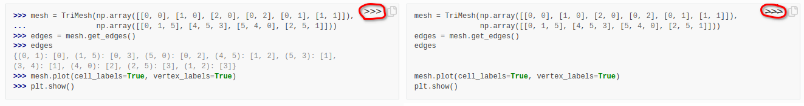
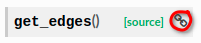
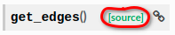

# Documentation

The documentation for *CristalX* is available both locally and online. It is generated by [Sphinx](https://www.sphinx-doc.org) and consists of the code documentation and the various guides (including the one you are currently reading). If you want to extend the documentation, please read the [corresponding section](dev_documentation) in the Developer guide.

## Local documentation

It resides in the `docs/` directory. Open a terminal there and type `make html`. The output will be written to `docs/build/`. Open `docs/build/html/index.html` to land on the home page of the documentation.

## Online documentation

For every [push event](development.md#general-workflow), the documentation is rebuilt by [Read the Docs](https://readthedocs.org/). The latest HTML version is available on [https://cristalx.readthedocs.io/en/latest](https://cristalx.readthedocs.io/en/latest/). Read the Docs is [configured](https://github.com/CsatiZoltan/CristalX/blob/master/.readthedocs.yml) to build a PDF and EPUB output as well. All three formats can be downloaded for offline use if you click on the bottom of the left sidebar. For convenience, here are the direct links: [HTML](https://cristalx.readthedocs.io/_/downloads/en/latest/htmlzip/), [PDF](https://cristalx.readthedocs.io/_/downloads/en/latest/pdf/), [EPUB](https://cristalx.readthedocs.io/_/downloads/en/latest/epub/).

## Using the HTML documentation

For browsing on a computer, the HTML documentation is the most convenient and feature-rich.

The side-bar on the left provides quick navigation.

Code example boxes have two toggle buttons. Clicking on the prompt button `>>>` hides the prompt and the output. If you then click on the copy icon next to it, you can copy the contents of the box, making it easy to try the code chunks in your Python environment.

A direct link can be obtained for most sections, including the code documentation, by moving the cursor to the right of the text and then clicking on the chain icon. 

When browsing the API documentation and want to look at the implementation, you can easily access the source code by clicking on the `[source]` tag. 

